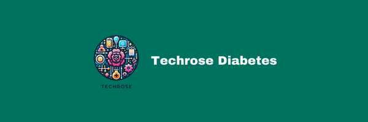

[Demo]: https://www.youtube.com/watch?v=z5Ad3D7VYT4
[Linkedin]: https://www.linkedin.com/company/techrose/

<p align="center">

[Demo] 
[Linkedin]

  <h3 align="center">TECHROSE DİABETES APP</h3>

  <p align="center">
    "Manage Your Diabetes, Shape Your Life: You Have the Power!"


   
  </p>
</p>


## Table Of Contents

* [About the Project](#about-the-project)
* [Built With](#built-with)
* [Getting Started](#getting-started)
* [Authors](#authors)

## About The Project

Managing diabetes is now easier and more effective than ever! The Techrose Diabetes Monitoring App eliminates the challenges associated with diabetes by intelligently tracking your health data. Dealing with traditional blood sugar measurements is a thing of the past. Now, you have a powerful solution to better manage your diabetes.

Why Choose Techrose?

Saves Time: Compared to traditional methods, tracking your health data is now faster and easier.

Accurate Data: Prevent errors. Techrose helps you accurately record your health data and obtain reliable results.

Personalized Recommendations: By considering your dietary habits, physical activities, and other health indicators, Techrose provides you with personalized recommendations.

## Built With

React Native: React Native was used in the development of the mobile application. It provides a single codebase that can run on both iOS and Android platforms, thus accelerating the development process and reducing costs.

fetch: The fetch library is employed for making HTTP requests and communicating with the server. It manages data exchange processes and enables user interaction with the platform.

React Native Navigation: React Native Navigation is utilized for managing the user interface. It simplifies navigation within the application and enhances the user experience.

Asp.Net Core Api Integration: Asp.Net Core Api integration is implemented to manage backend data processing and server logic. It ensures secure processing and storage of user data.

React Native Chart Kit: React Native Chart Kit is a library used to visualize data in React Native-based mobile applications. This library provides components to create various types of charts (such as line charts, bar charts, pie charts, etc.) and enables these charts to be displayed in a user-friendly manner in mobile applications.

1) Data Visualization: It's important for users of a diabetes application to visually track their health data, such as blood sugar levels, dietary habits, exercise activities, etc. React Native Chart Kit presents this data in attractive charts, making it easier for users to understand

2) User Experience: Charts allow users to analyze their health data more quickly and effectively, enhancing the user experience and making the application more user-friendly.

3) Customization: With the variety of chart types and configuration options offered by React Native Chart Kit, you can easily customize the charts in the diabetes application to fit the requirements of the application. For example, you can create a line chart showing the trend of blood sugar levels over a specific time period.

4) Data Analysis: Charts enable users to analyze their data in depth, helping them better understand health trends and changes over specific time periods.


React Native Tailwind: React Native Tailwind, is an adapted version of Tailwind CSS, a CSS framework used in React Native applications.


## Getting Started

WELCOME TO THE TECHROSE DIABETES APP! We're excited to have you on board. Below is a guide to help you get started with our project:

1. Prerequisites Before you begin, ensure you have the following prerequisites installed on your local machine:

* Node.js and npm: Ensure that Node.js and npm are installed on your computer. You can download and install them from the official Node.js website.

* React Native CLI: Install the React Native CLI globally by running the following command in your terminal:
```
            npm install -g react-native-cli 
```
* Android Studio or Xcode: Depending on your target platform (Android or iOS), make sure you have either Android Studio or Xcode installed and properly configured on your system.

2. Installation Follow these steps to install and run the project locally:

* Clone the repository to your local machine:
```
     git clone https://github.com/your-username/RenewedTechroseMobile
```
* Navigate to the project directory:
```
         cd RenewedTechroseMobile
```
* Install dependencies:
```
          npm install
```
3. Running the Mobile App The mobile application part of the project is built using React Native, a framework for building native applications using JavaScript and React. To run the mobile app on your device or simulator/emulator, follow these steps:

* For iOS:

Before running the app on an iOS device or simulator, make sure you have Xcode installed on your machine.
```
          react-native run-ios
```

* For Android:

Before running the app on an Android device or emulator, make sure you have Android Studio installed and an emulator set up, or a physical Android device connected to your computer via USB debugging.
```
          react-native run-android
```


## Authors

* **Furkan Nadir Ağlar** - *Frontend Developer* - [Furkan Nadir Ağlar](https://github.com/FurkanNadirAglar) - *Frontend Developer*
* **Mehmet Solak ** - *Full Stack Developer* - [Mehmet Solak ](https://github.com/knetic0) - *Full Stack Developer*
* **Doğukan Aksoy ** - *Full Stack Developer * - [Doğukan Aksoy ](https://github.com/Dredogu) - *Full Stack Developer *
* **Zülfücan Karakuş ** - *Frontend Developer * - [Zülfücan Karakuş ](https://github.com/zulfucankarakus) - *Frontend Developer*

